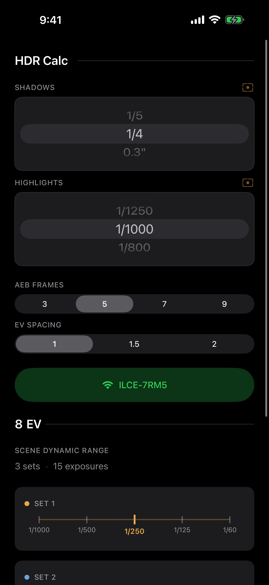
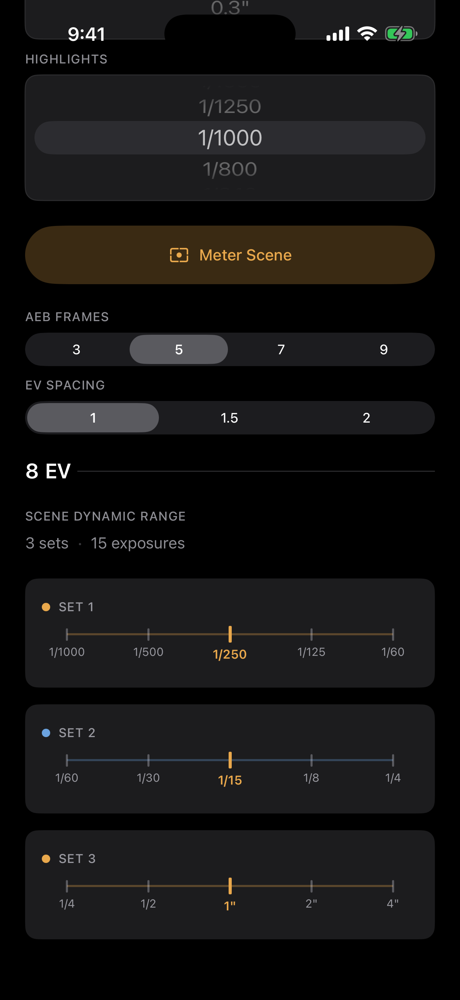
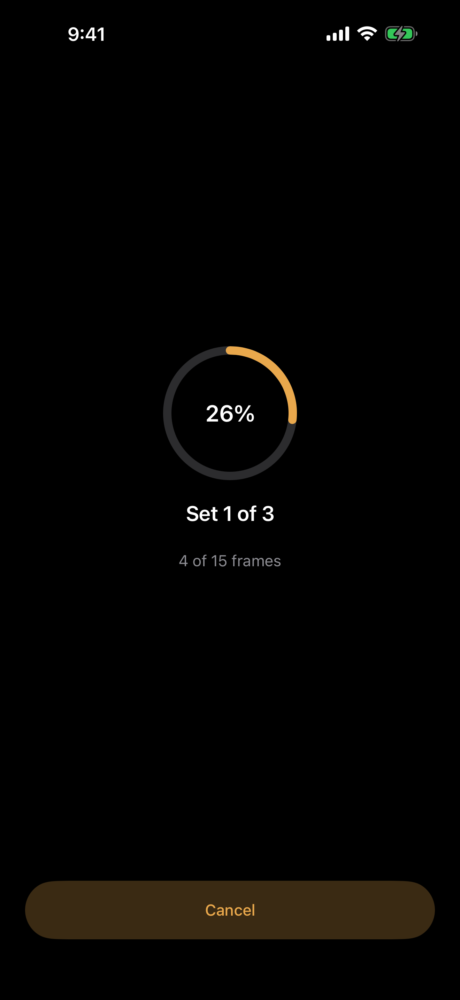
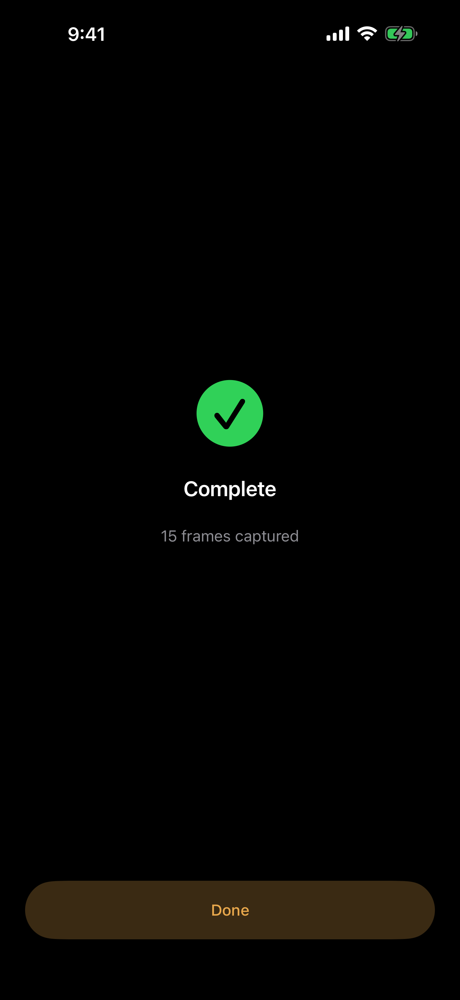

<p align="center">
  <br>
  <picture>
    <source media="(prefers-color-scheme: dark)" srcset="data:image/svg+xml,%3Csvg xmlns='http://www.w3.org/2000/svg' viewBox='0 0 80 80'%3E%3Cdefs%3E%3ClinearGradient id='gd' x1='0' y1='0' x2='1' y2='1'%3E%3Cstop offset='0%25' stop-color='%23E9A84C'/%3E%3Cstop offset='100%25' stop-color='%23D4881E'/%3E%3C/linearGradient%3E%3C/defs%3E%3Ccircle cx='40' cy='40' r='36' fill='none' stroke='url(%23gd)' stroke-width='1.5' opacity='0.3'/%3E%3Ccircle cx='40' cy='40' r='28' fill='none' stroke='url(%23gd)' stroke-width='1.5' opacity='0.5'/%3E%3Ccircle cx='40' cy='40' r='20' fill='none' stroke='url(%23gd)' stroke-width='2'/%3E%3Ccircle cx='40' cy='40' r='11' fill='none' stroke='url(%23gd)' stroke-width='2'/%3E%3Ccircle cx='40' cy='40' r='4' fill='%23E9A84C'/%3E%3Cline x1='40' y1='4' x2='40' y2='12' stroke='%23E9A84C' stroke-width='1' opacity='0.4'/%3E%3Cline x1='40' y1='68' x2='40' y2='76' stroke='%23E9A84C' stroke-width='1' opacity='0.4'/%3E%3Cline x1='4' y1='40' x2='12' y2='40' stroke='%23E9A84C' stroke-width='1' opacity='0.4'/%3E%3Cline x1='68' y1='40' x2='76' y2='40' stroke='%23E9A84C' stroke-width='1' opacity='0.4'/%3E%3C/svg%3E">
    
  </picture>
</p>

<h1 align="center">HDR Calc</h1>

<p align="center">
  <strong>Exposure bracketing, solved.</strong>
  <br><br>
  <a href="#how-it-works">How It Works</a>&ensp;&ensp;|&ensp;&ensp;<a href="#web">Web</a>&ensp;&ensp;|&ensp;&ensp;<a href="#ios">iOS</a>&ensp;&ensp;|&ensp;&ensp;<a href="#privacy">Privacy</a>
</p>

<p align="center">
  &ensp;
  &ensp;
  &ensp;
  
</p>

Set your shadow and highlight speeds, pick your AEB frame count and EV spacing, and the app instantly shows every bracket set you need to capture. Built for real estate, architecture, landscape, and interior photography.

> **1/3-stop scale** from 1/8000s to 30s&ensp;&ensp;·&ensp;&ensp;**3, 5, 7, or 9** AEB frames&ensp;&ensp;·&ensp;&ensp;**1 / 1.5 / 2** EV spacing
>
> **Tap-to-meter** from the camera sensor&ensp;&ensp;·&ensp;&ensp;**Sony remote control** over Wi-Fi
>
> **Web** (offline PWA)&ensp;&ensp;+&ensp;&ensp;**iOS** (SwiftUI)

---

## How It Works

Meter the brightest and darkest parts of your scene. HDR Calc figures out the rest.

```
  SHADOWS           1/4 sec
  HIGHLIGHTS        1/1000 sec
  AEB FRAMES        3  [5]  7   9
  EV SPACING       [1]  1.5   2

  ───────────────────────────────
  8 EV  ·  3 sets  ·  15 frames
  ───────────────────────────────

  Set 1   ├──┼──┼──╋──┼──┤
          1/1000    1/250    1/60

  Set 2   ├──┼──┼──╋──┼──┤
          1/60      1/15     1/4

  Set 3   ├──┼──┼──╋──┼──┤
          1/4       1"       4"
```

Adjacent sets overlap by one frame. No tonal gaps. The algorithm rounds toward darker exposures for extra safety margin.

---

## Web

SvelteKit PWA. Works offline. No dependencies beyond the framework.

```sh
cd web
npm install
npm run dev          # localhost:5173
```

Installable as a home screen app on any device.

| | |
|:--|:--|
| Framework | SvelteKit 2 + Svelte 5 |
| Language | TypeScript |
| Tests | Vitest (`npm test`) |
| Build | Vite (`npm run build`) |

---

## iOS

Native SwiftUI app targeting iOS 17+. Single-screen layout on iPhone, two-column on iPad.

**Bracketing** &ensp; Wheel pickers for the full 55-value shutter speed scale. Tick-mark ruler visualization for each set.

**Camera metering** &ensp; Tap the meter button to open a live camera view. Point at the scene, tap to set the metering point, and the app reads the exposure directly from the sensor, mapped to the nearest 1/3-stop.

**Sony camera control** &ensp; Connect to a supported Sony camera over Wi-Fi. The app sets each shutter speed, verifies the setting, and fires the shutter automatically for every frame in your bracket sets. A progress ring tracks completed frames. If verification fails after retries, the loop stops and reports partial progress so you can reconnect and continue.

**Accessibility** &ensp; VoiceOver, Dynamic Type, and Reduced Motion support. Adaptive light and dark appearance.

---

## Privacy

No data collected. No analytics, no tracking, no network requests.

Camera access (iOS) is used solely for real-time exposure metering. No frames are recorded or transmitted.

---

<p align="center">
  No ads&ensp;&ensp;·&ensp;&ensp;No subscriptions&ensp;&ensp;·&ensp;&ensp;No account
  <br>
  <sub>Just open it, enter your speeds, and shoot.</sub>
</p>
