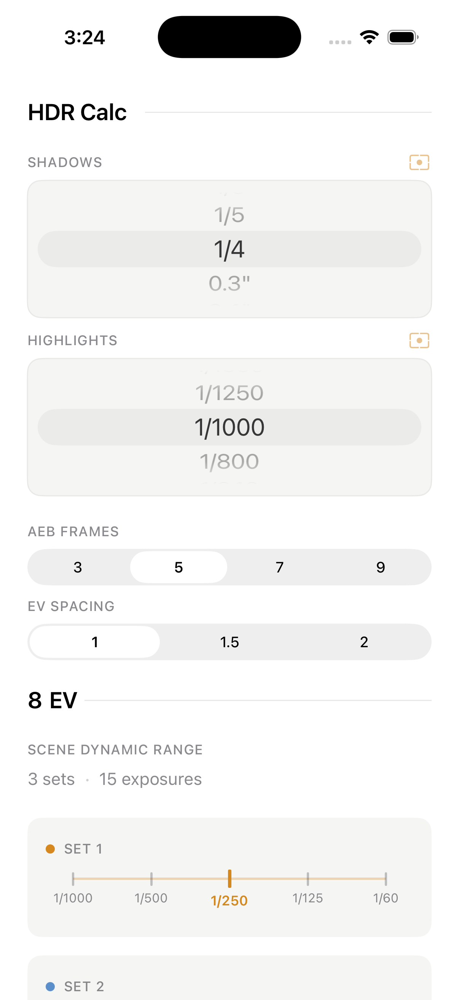
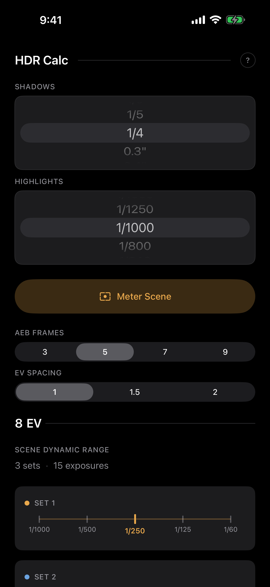

<p align="center">
  <br>
  <picture>
    <source media="(prefers-color-scheme: dark)" srcset="data:image/svg+xml,%3Csvg xmlns='http://www.w3.org/2000/svg' viewBox='0 0 32 32'%3E%3Crect x='4' y='8' width='24' height='16' rx='3' fill='none' stroke='%23E9A84C' stroke-width='2'/%3E%3Ccircle cx='16' cy='16' r='5' fill='none' stroke='%23E9A84C' stroke-width='2'/%3E%3Ccircle cx='16' cy='16' r='2' fill='%23E9A84C'/%3E%3Crect x='12' y='6' width='8' height='3' rx='1' fill='%23E9A84C'/%3E%3C/svg%3E">
    
  </picture>
  <br><br>
</p>

<h1 align="center">HDR Calc</h1>

<p align="center">
  <strong>Exposure bracketing, solved.</strong>
  <br>
  <sub>Enter your metered shutter speeds. See your bracket sets instantly.</sub>
</p>

<br>

<p align="center">
  <a href="#web">Web</a>&ensp;&middot;&ensp;<a href="#ios">iOS</a>&ensp;&middot;&ensp;<a href="#how-it-works">How It Works</a>&ensp;&middot;&ensp;<a href="#privacy">Privacy</a>
</p>

<br>

---

<br>

HDR Calc is a precision exposure bracketing calculator for photographers who shoot HDR. Set your shadow and highlight speeds, pick your AEB frame count and EV spacing, and the app instantly shows every bracket set you need to capture.

Built for real estate, architecture, landscape, and interior photography.

<p align="center">
  &emsp;
  
</p>

<br>

### At a Glance

| | |
|:--|:--|
| **Shutter speeds** | Full 1/3-stop scale, 1/8000s to 30s |
| **AEB frames** | 3, 5, 7, or 9 per set |
| **EV spacing** | 1, 1.5, or 2 stops |
| **Camera metering** | Tap to meter from the scene (iOS) |
| **Sony camera control** | Connect, set speeds, and shoot remotely (iOS) |
| **Platforms** | Web (PWA) + iOS (SwiftUI) |

<br>

---

<br>

## How It Works

Meter the brightest and darkest parts of your scene. HDR Calc figures out the rest.

```
  HDR Calc ─────────────────

  SHADOWS
  ┌───────────────────────┐
  │       1/4 sec         │
  └───────────────────────┘

  HIGHLIGHTS
  ┌───────────────────────┐
  │      1/1000 sec       │
  └───────────────────────┘

  AEB FRAMES
  ┌─────┬─────┬─────┬─────┐
  │  3  │ [5] │  7  │  9  │
  └─────┴─────┴─────┴─────┘

  EV SPACING
  ┌───────┬───────┬───────┐
  │  [1]  │  1.5  │   2   │
  └───────┴───────┴───────┘

  8 EV ─────────────────────
  SCENE DYNAMIC RANGE
  3 sets  ·  15 exposures

  ● Set 1
  ├──┼──┼──╋──┼──┤
  1/1000    1/250    1/60

  ● Set 2
  ├──┼──┼──╋──┼──┤
  1/60      1/15     1/4

  ● Set 3
  ├──┼──┼──╋──┼──┤
  1/4       1"       4"
```

Adjacent sets overlap by one frame. No tonal gaps. The algorithm rounds toward darker exposures for extra safety margin.

<br>

---

<br>

## Web

SvelteKit PWA. Works offline. No dependencies beyond the framework.

```sh
cd web
npm install
npm run dev
```

Runs at `localhost:5173`. Installable as a home screen app on any device.

<br>

#### Stack

| | |
|:--|:--|
| Framework | SvelteKit 2 + Svelte 5 |
| Language | TypeScript |
| Tests | Vitest |
| Build | Vite |

```sh
npm test        # run test vectors
npm run build   # production build
```

<br>

---

<br>

## iOS

Native SwiftUI app targeting iOS 17+. Single-screen layout on iPhone, two-column on iPad.

#### Features

- Wheel pickers for the full 55-value shutter speed scale
- Live camera metering with tap-to-expose
- Tick-mark ruler visualization for each bracket set
- Sony camera control: connect via Wi-Fi, set shutter speeds, and fire the shutter remotely
- Automated shooting loop with per-frame progress tracking
- Adaptive light and dark appearance
- VoiceOver, Dynamic Type, and Reduced Motion support

#### Camera Metering

Tap the meter button next to either speed picker to open a live camera view. Point at the scene, tap to set the metering point, and the app reads the exposure directly from the camera sensor, mapped to the nearest 1/3-stop value.

#### Sony Camera Control

Connect to a supported Sony camera over Wi-Fi. The app sets each shutter speed, verifies the setting, and fires the shutter automatically for every frame in your bracket sets. A progress ring tracks completed frames. If a shutter speed fails to verify after retries, the loop stops and reports partial progress so you can reconnect and continue.

<br>

---

<br>

## Project Structure

```
hdr_calc/
  test_vectors.json         Shared parity contract
  web/
    src/
      lib/
        calculator.ts       Core algorithm
        speeds.ts           Shutter speed lookup table
        components/         UI components
      routes/
        +page.svelte        Main interface
        privacy/            Privacy policy
  ios/
    HDRCalc/
      HDRCalcApp.swift      App entry point
      Calculator.swift      Core algorithm (Swift port)
      Speeds.swift          Speed table + nearestSpeed()
      Theme.swift           Colors + spacing constants
      ContentView.swift     Main UI
      CameraService.swift   AVCaptureSession + metering
      MeterView.swift       Camera preview sheet
    HDRCalcTests/
      SpeedsTests.swift     Speed table + lookup tests
      CalculatorTests.swift Test vector parity tests
```

Both implementations validate against the same `test_vectors.json` to guarantee parity.

<br>

---

<br>

## Privacy

HDR Calc collects no data. No analytics, no tracking, no network requests.

Camera access (iOS) is used solely for real-time exposure metering. No frames are recorded or transmitted.

[Full privacy policy](/privacy)

<br>

---

<br>

<p align="center">
  <sub>No ads. No subscriptions. No account required.</sub>
  <br>
  <sub>Just open it, enter your speeds, and shoot.</sub>
</p>
