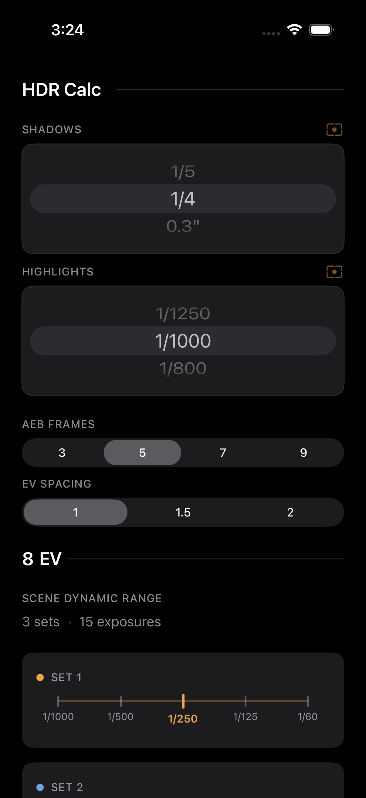
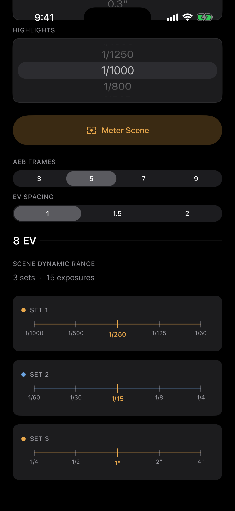
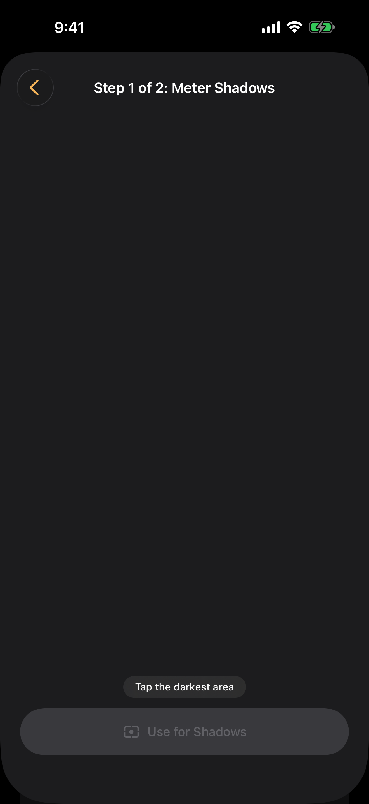
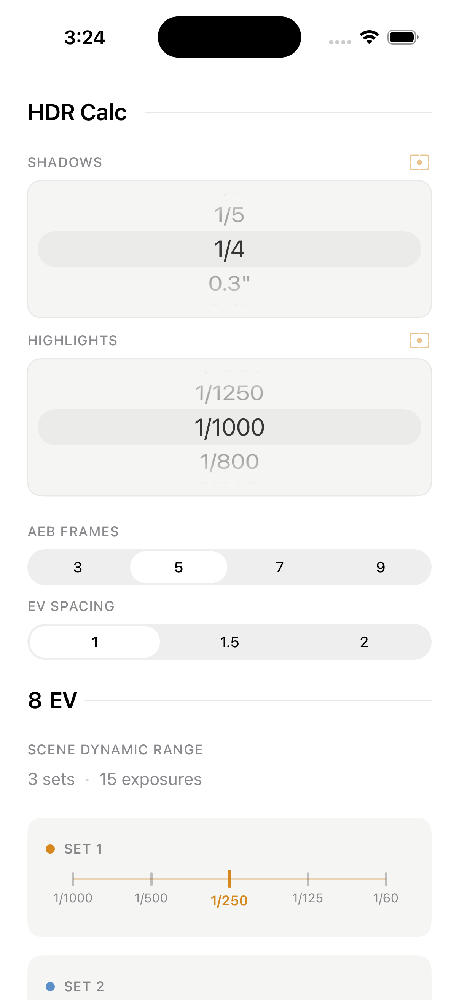

   
  <picture>
    <source media="(prefers-color-scheme: dark)" srcset="data:image/svg+xml,%3Csvg xmlns='http://www.w3.org/2000/svg' viewBox='0 0 80 80'%3E%3Cdefs%3E%3ClinearGradient id='gd' x1='0' y1='0' x2='1' y2='1'%3E%3Cstop offset='0%25' stop-color='%23E9A84C'/%3E%3Cstop offset='100%25' stop-color='%23D4881E'/%3E%3C/linearGradient%3E%3C/defs%3E%3Ccircle cx='40' cy='40' r='36' fill='none' stroke='url(%23gd)' stroke-width='1.5' opacity='0.3'/%3E%3Ccircle cx='40' cy='40' r='28' fill='none' stroke='url(%23gd)' stroke-width='1.5' opacity='0.5'/%3E%3Ccircle cx='40' cy='40' r='20' fill='none' stroke='url(%23gd)' stroke-width='2'/%3E%3Ccircle cx='40' cy='40' r='11' fill='none' stroke='url(%23gd)' stroke-width='2'/%3E%3Ccircle cx='40' cy='40' r='4' fill='%23E9A84C'/%3E%3Cline x1='40' y1='4' x2='40' y2='12' stroke='%23E9A84C' stroke-width='1' opacity='0.4'/%3E%3Cline x1='40' y1='68' x2='40' y2='76' stroke='%23E9A84C' stroke-width='1' opacity='0.4'/%3E%3Cline x1='4' y1='40' x2='12' y2='40' stroke='%23E9A84C' stroke-width='1' opacity='0.4'/%3E%3Cline x1='68' y1='40' x2='76' y2='40' stroke='%23E9A84C' stroke-width='1' opacity='0.4'/%3E%3C/svg%3E">
    
  </picture>

<h1 align="center">HDR Calc</h1>

  <strong>Exposure bracketing field reference</strong>
    
  <a href="#01--concept">Concept</a>&ensp;&ensp;|&ensp;&ensp;<a href="#02--mechanics">Mechanics</a>&ensp;&ensp;|&ensp;&ensp;<a href="#03--web">Web</a>&ensp;&ensp;|&ensp;&ensp;<a href="#04--ios">iOS</a>&ensp;&ensp;|&ensp;&ensp;<a href="#05--privacy">Privacy</a>

  &ensp;
  &ensp;
  &ensp;
  

Set your shadow and highlight speeds, pick AEB frame count and EV spacing, and the app shows every bracket set you need. Built for real estate, architecture, landscape, and interior photography.

| Shadows | Highlights | Frames | Spacing |
| :-: | :-: | :-: | :-: |
| **1/4s** | **1/1000s** | **5** | **1 EV** |
| Darkest detail | Brightest detail | Per AEB set | Per scene |

---

## 01 · Concept

### Two readings

Meter the brightest and darkest parts of your scene. HDR Calc figures out every bracket set you need to cover the full tonal range — no gaps, with a safety margin toward darker exposures.

1. Meter your **shadows** — the darkest area you want detail in. Note the shutter speed.
2. Meter your **highlights** — the brightest area you want detail in. Note that shutter speed.
3. Pick your camera's **AEB frame count** (3, 5, 7, 9) and **EV spacing** (1, 1.5, 2).
4. Read the results — every bracket set with the center shutter speed.

> **Overlap by design.** Adjacent sets overlap by one frame. The algorithm rounds toward darker exposures so shadow detail is never sacrificed.

---

## 02 · Mechanics

### Stop scale

The shutter speed picker steps through the standard **1/3-stop** scale used by every modern camera — 55 values from `1/8000s` to `30s`.

### Inputs

| Field | Value | |
| --- | --- | :-: |
| Shadows | Shutter speed for darkest detail | LOCKED |
| Highlights | Shutter speed for brightest detail | LOCKED |
| AEB Frames | 3, 5, 7, or 9 per set | LOCKED |
| EV Spacing | 1, 1.5, or 2 stops | PER SHOT |

### Worked example

Shadows `1/4s`, highlights `1/1000s` — an **8 EV** range. With 5-frame AEB at 1 EV spacing, three sets cover the range with one-frame overlap.

| Set | Start | Center | End |
| :-: | :-: | :-: | :-: |
| 1 | `1/1000` | `1/250` | `1/60` |
| 2 | `1/60` | `1/15` | `1/4` |
| 3 | `1/4` | `1"` | `4"` |

> **8 EV · 3 sets · 15 frames.** Each set's last frame matches the next set's first frame — continuous tonal coverage.

---

## 03 · Web

### Progressive Web App

Open in any browser and install as a home-screen app on iOS, Android, macOS, or Windows. Works fully offline once installed.

<table>
  <tr><td><b>Pickers</b></td><td>Full 55-value 1/3-stop shutter speed scale</td></tr>
  <tr><td><b>Visualization</b></td><td>Tick-mark ruler per bracket set</td></tr>
  <tr><td><b>Backend</b></td><td>None — static HTML and JavaScript</td></tr>
  <tr><td><b>Network</b></td><td>Zero requests after install</td></tr>
  <tr><td><b>Accessibility</b></td><td>Keyboard nav, ARIA labels, adaptive light/dark</td></tr>
  <tr><td><b>Stack</b></td><td>SvelteKit + TypeScript</td></tr>
</table>

---

## 04 · iOS

### Native app

Native SwiftUI for iPhone and iPad. iOS 17 or later. Single-screen on iPhone, two-column on iPad.

<table>
  <tr><td><b>Pickers</b></td><td>Wheel pickers on the full 1/3-stop scale</td></tr>
  <tr><td><b>Visualization</b></td><td>Tick-mark ruler per bracket set</td></tr>
  <tr><td><b>Layout</b></td><td>Single-screen iPhone · two-column iPad</td></tr>
  <tr><td><b>Accessibility</b></td><td>VoiceOver, Dynamic Type, Reduced Motion</td></tr>
  <tr><td><b>Stack</b></td><td>SwiftUI</td></tr>
</table>

### Camera metering

Tap **Meter Scene** to open a two-phase camera flow. The camera reads exposure directly from the sensor and maps it to the nearest 1/3-stop.

1. Point at the **darkest** area you want detail in. Tap to meter shadows.
2. Confirm. The app advances to step 2 with the camera still live.
3. Point at the **brightest** area. Tap to meter highlights.
4. Both speeds drop straight into the calculator.

> **One session, two readings, no friction** — the camera stays live throughout both phases.

---

## 05 · Privacy

### Data

<table>
  <tr><td><b>Collected</b></td><td>Nothing</td></tr>
  <tr><td><b>Analytics</b></td><td>None</td></tr>
  <tr><td><b>Tracking</b></td><td>None</td></tr>
  <tr><td><b>Network requests</b></td><td>Zero</td></tr>
  <tr><td><b>Account required</b></td><td>No</td></tr>
</table>

### Camera (iOS)

Camera access is used **solely** for real-time exposure metering. Frames are processed on-device and discarded. Nothing is recorded, saved, or transmitted.

---

  No ads&ensp;&ensp;·&ensp;&ensp;No subscriptions&ensp;&ensp;·&ensp;&ensp;No account
   
  Just open it, enter your speeds, and shoot.

